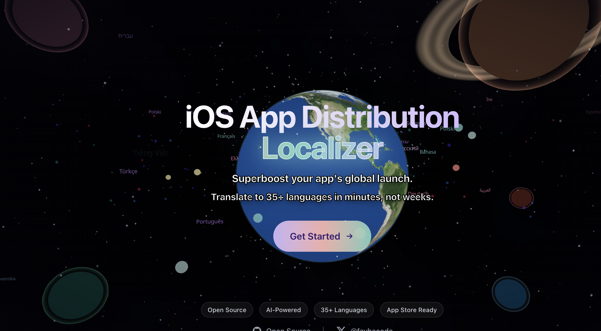
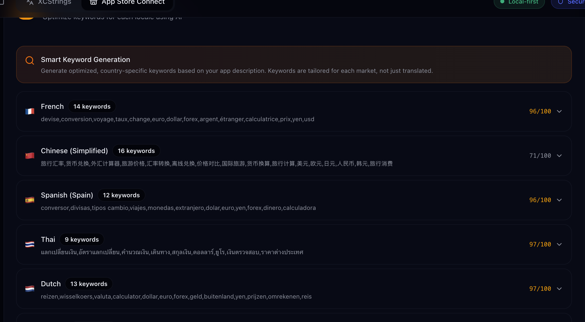

# iOS xcstrings & App Store Connect Localizer

[](https://github.com/fayharinn/iOS-App-Distribution-Localizer/stargazers)
[](https://github.com/fayharinn/iOS-App-Distribution-Localizer/issues)
[](https://www.gnu.org/licenses/agpl-3.0.html)
[](https://github.com/fayharinn/iOS-App-Distribution-Localizer/commits/main)

A modern web application for translating iOS/macOS `.xcstrings` files, App Store Connect metadata, and building polished App Store screenshots with AI-assisted workflows.

## Preview





<details>
<summary>More screenshots</summary>

| App Store Connect | XCStrings Editor |
|:-:|:-:|
|  |  |

</details>

## Quick Start

### Try it Online
Visit the live demo: **https://localizer.fayhe.com/**

### Run Locally
```bash
git clone https://github.com/yourusername/xcstrings-localizer.git
cd xcstrings-localizer
npm install
npm run dev
```


## Features

### XCStrings Translation
- Upload and parse `.xcstrings` localization files
- Translate to 35+ languages using AI (OpenAI, AWS Bedrock)
- Protected words that won't be translated (brand names, app names)
- Batch processing with configurable concurrency
- View and edit translations in a table editor
- Export translated files

### App Store Connect Integration
- Connect to App Store Connect API with your credentials
- Browse apps and versions
- Auto-translate app metadata (description, what's new, keywords, promotional text)
- Create new app versions
- Edit localizations directly

### Screenshot Maker
- Build App Store-ready screenshots with 2D + 3D device mockups
- Per-screenshot layouts: background, shadows, frames, and positioning
- Multi-language headlines/subheadlines with AI translation
- Inline formatting for emphasis (`*bold*`) and line breaks (`<br>`)
- Batch export as ZIP per language

## Tech Stack

- **React 18** + **Vite**
- **Tailwind CSS** + **shadcn/ui**
- **jose** for JWT signing (App Store Connect API auth)
- **Three.js** + Canvas for screenshot rendering

## Installation

```bash
# Clone the repository
git clone https://github.com/yourusername/xcstrings-localizer.git
cd xcstrings-localizer

# Install dependencies
npm install

# Start development server
npm run dev
```

## Configuration

### AI Provider

Configure your AI provider in the sidebar:

| Provider | API Key Format | Models |
|----------|---------------|--------|
| OpenAI | `sk-...` | GPT-5-mini, GPT-5-nano |
| AWS Bedrock | `ACCESS_KEY:SECRET_KEY` | Claude Haiku/Sonnet/Opus 4.5 |

### App Store Connect

1. Go to [App Store Connect > API Keys](https://appstoreconnect.apple.com/access/integrations/api)
2. Create a new API key with appropriate permissions
3. Note your **Key ID** and **Issuer ID**
4. Download the `.p8` private key file
5. Enter credentials in the sidebar and upload the `.p8` file

#### Authentication Flow

```
┌─────────────────────────────────────────────────────────────────────────────┐
│                         App Store Connect Auth Flow                         │
├─────────────────────────────────────────────────────────────────────────────┤
│                                                                             │
│  ┌──────────┐    password     ┌──────────────┐                              │
│  │  .p8 Key │ ──────────────► │  Encrypted   │ ◄─── Stored in localStorage  │
│  │  (file)  │    encrypt      │   .p8 Key    │      (persistent)            │
│  └────┬─────┘                 └──────┬───────┘                              │
│       │                              │                                      │
│       │ sign                         │ password                             │
│       │                              │ decrypt                              │
│       ▼                              ▼                                      │
│  ┌──────────┐                 ┌──────────────┐                              │
│  │   JWT    │ ◄───────────────│  Decrypted   │                              │
│  │  Token   │     sign        │   .p8 Key    │ ◄─── In memory only          │
│  └────┬─────┘                 └──────────────┘      (cleared on reload)     │
│       │                                                                     │
│       │ cache                                                               │
│       ▼                                                                     │
│  ┌──────────────┐                                                           │
│  │ sessionStorage│ ◄─── JWT cached for ~19 min                              │
│  │  (JWT only)   │      Auto-reconnect on page reload                       │
│  └──────┬───────┘       Timer shows remaining time                          │
│         │                                                                   │
│         │ Bearer token                                                      │
│         ▼                                                                   │
│  ┌──────────────┐                                                           │
│  │  App Store   │                                                           │
│  │ Connect API  │                                                           │
│  └──────────────┘                                                           │
│                                                                             │
└─────────────────────────────────────────────────────────────────────────────┘
```

**Security notes:**
- The `.p8` private key is **never** stored in plain text
- Optional encryption with your password stores the key in localStorage
- Only the JWT token (valid ~19 min) is cached in sessionStorage
- On page reload: if JWT is still valid, auto-reconnects without needing the `.p8` key
- All cryptographic operations happen locally in the browser
- No key material is ever transmitted to any server


### Project Structure

```
src/
├── components/
│   ├── ui/              # shadcn/ui components
│   ├── AppSidebar.jsx   # Main sidebar with configuration
│   └── AppStoreConnect.jsx  # ASC page
├── services/
│   ├── translationService.js    # AI translation logic
│   └── appStoreConnectService.js # ASC API client
├── utils/
│   └── xcstringsParser.js  # .xcstrings file parser
├── hooks/
│   └── use-mobile.js    # Responsive hook
├── lib/
│   └── utils.js         # Utility functions
└── App.jsx              # Main application
```

## Production Deployment

### CORS Issue

The App Store Connect API doesn't support CORS. In localhost you'll not have issue, but if you want to upload it online, here is the recommended option:


#### Option 1: Cloudflare (Recommended)

Deploy both the site and API proxy to Cloudflare:

```bash
# Install Wrangler CLI
npm install -g wrangler
wrangler login

# 1. Deploy the API proxy (worker/)
wrangler deploy -c wrangler.proxy.jsonc
# Note the URL: https://xcstrings-localizer-proxy.YOUR_ACCOUNT.workers.dev

# 2. Set the proxy URL for production build
echo "VITE_ASC_PROXY_URL=https://xcstrings-localizer-proxy.YOUR_ACCOUNT.workers.dev" > .env.production

# 3. Build and deploy the site
npm run build
wrangler pages deploy dist --project-name=xcstrings-localizer
```

Your site will be live at `https://xcstrings-localizer.pages.dev`


## Contributing

Contributions are welcome!


## License

Licensed under the GNU AGPLv3: https://www.gnu.org/licenses/agpl-3.0.html


## Acknowledgments

Screenshot generator forked from https://github.com/YUZU-Hub/appscreen by Stefan from yuzuhub.com

---

[](https://x.com/fayhecode)
